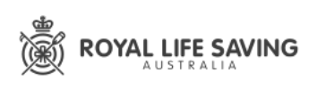
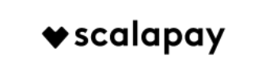

:::{#hero-heading}


:::


```{=html}
<style>
.banner-track {
  display: flex;
  width: max-content;
  animation: scroll-left 20s linear infinite;
}
.banner-track img {
  height: 100px;
  width: auto;
  margin-right: 16px;
  border-radius: 8px;
}
.banner-wrapper {
  overflow: hidden;
  width: 100%;
}
@keyframes scroll-left {
  0%   { transform: translateX(0); }
  100% { transform: translateX(-50%); }
}
</style>

<div class="banner-wrapper">
  <div class="banner-track">
    <!-- Duplicate images so scrolling loops seamlessly -->
    
    
    
    
    
    
    
    
    <!-- Duplicates for seamless loop -->
    
    
    
    
    
    
    
    
  </div>
</div>
```

```{=html}
<div class="testimonial-box">
  <div class="testimonial-content">
    <div class="client-photo">
      
    </div>
    <div class="testimonial-text">
      <blockquote>
        "Dean and Wave Data Labs brought a rare combination of high-level technical skill, with seamless collaboration and flexibility. They were able to quickly identify and scope critical improvements to our data model and machine learning algorithms. As well as producing high-quality technical outputs, Wave Data Labs worked in a way that uplifted the capability of our internal team, delivering lasting improvements to our ways of working."
      </blockquote>
      <p class="client-name">Tom O’Connor, CEO AptoNow</p>
    </div>
  </div>
</div>
```  

```{=html}
<div class="testimonial-box">
  <div class="testimonial-content">
    <div class="client-photo">
      
    </div>
    <div class="testimonial-text">
      <blockquote>
        "You were able to work toward our goals, making suggestions to improve the workflow and then execute those suggestions in the code. You were friendly, thoughtful and hard working. We're really happy with the package you delivered. Thanks!"
      </blockquote>
      <p class="client-name">Dr Melinda Rostal, Principal Scientist, EcoHealth Alliance</p>
    </div>
  </div>
</div>
```

```{=html}
<div class="testimonial-box">
  <div class="testimonial-content">
    <div class="client-photo">
      
    </div>
    <div class="testimonial-text">
      <blockquote>
        "Dean's ability to unpack problems, package, engage, present, influence, validate, mentor and resolve is fantastic and highly sought after."
      </blockquote>
      <p class="client-name">Paul Oyston, Group Head of IT Data Analytics, IRT Group</p>
    </div>
  </div>
</div>
```  


<!-- Calendly badge widget begin -->
<link href="https://assets.calendly.com/assets/external/widget.css" rel="stylesheet">
<script src="https://assets.calendly.com/assets/external/widget.js" type="text/javascript" async></script>
<script type="text/javascript">window.onload = function() { Calendly.initBadgeWidget({ url: 'https://calendly.com/wavedata', text: 'Schedule a time to chat', color: '#0069ff', textColor: '#ffffff', branding: true }); }</script>
<!-- Calendly badge widget end -->